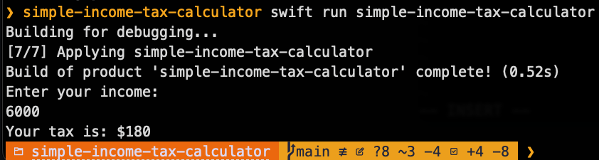

# Simple Income Tax Calculator

**Author:** [Eric Popelka](https://github.com/arickp)

A command-line Swift application that calculates income tax based on configurable tax brackets using a flat-rate tax system.

## Features

- 🧮 Simple tax calculation using configurable brackets
- 📁 JSON-based tax configuration
- 🧪 Comprehensive test suite with 13 test cases
- ⚡ Fast command-line interface
- 🔧 Easy to modify tax rates and brackets

## Tax System

This calculator uses a **flat-rate tax system** where the entire income is taxed at the rate of the bracket it falls into:

| Income Range | Tax Rate |
|--------------|----------|
| $0 - $5,000 | 0% |
| $5,001 - $10,000 | 3% |
| $10,001 - $20,000 | 5.5% |
| $20,001 - $40,000 | 10.8% |
| $40,001+ | 23.7% |

### Example Calculations

- **Income: $35,000** → Tax: $3,780 (35,000 × 10.8%)
- **Income: $100,000** → Tax: $23,700 (100,000 × 23.7%)
- **Income: $0** → Tax: $0
- **Income: -$1** → Error (negative income not supported)

## Installation

### Prerequisites
- Swift 5.0 or later
- macOS, Linux, or Windows with Swift support

### Build
```bash
git clone https://github.com/arickp/simple-income-tax-calculator.git
cd simple-income-tax-calculator
swift build
```

Trying to build and run on Windows? [Watch the video: HOWTO-Run-on-Windows.mp4](./HOWTO-Run-on-Windows.mp4)

## Usage

### Run the application
```bash
swift run simple-income-tax-calculator
```

### Example session
```
Enter your income:
35000
Your tax is: $3780
```

## Screenshot



## Configuration

Tax rates are configurable via the JSON file at `Sources/simple-income-tax-calculator/Resources/taxConfig.json`:

```json
{
    "brackets": [
        {
            "min": 0,
            "max": 5000,
            "rate": 0
        },
        {
            "min": 5001,
            "max": 10000,
            "rate": 0.03
        },
        {
            "min": 10001,
            "max": 20000,
            "rate": 0.055
        },
        {
            "min": 20001,
            "max": 40000,
            "rate": 0.108
        },
        {
            "min": 40001,
            "rate": 0.237
        }
    ]
}
```

## Testing

Run the comprehensive test suite:

```bash
swift test
```

The test suite includes:
- ✅ Required test cases (income $35,000, $100,000, negative income)
- ✅ Edge cases (boundary conditions, zero income)
- ✅ Performance tests
- ✅ Error handling tests

## Project Structure

```
Sources/simple-income-tax-calculator/
├── main.swift              # Entry point
├── functions.swift         # Tax calculation logic
├── taxConfig.swift         # Configuration loading
├── errors.swift           # Error definitions
├── constants.swift        # Application constants
└── Resources/
    └── taxConfig.json     # Tax bracket configuration

Tests/simple-income-tax-calculatorTests/
└── simple_income_tax_calculatorTests.swift  # Test suite
```
